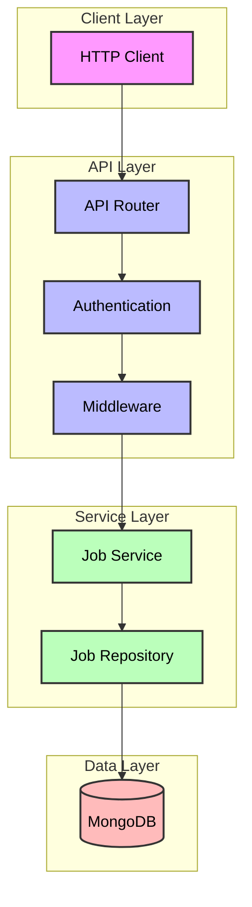

### High-Level Architecture

The application follows a layered architecture pattern with clear separation of concerns:

1. **Presentation Layer**: FastAPI endpoints handling HTTP requests
2. **Business Logic Layer**: Services implementing core job management
3. **Data Access Layer**: Repository pattern for MongoDB operations
4. **Infrastructure Layer**: Database connections and middleware

How components interact:


The diagram shows the request flow through the application, where:
- Requests start from the client and flow through the API layer's authentication and middleware
- The Job Service handles business logic while the Job Repository manages database operations
- Each layer has specific responsibilities, ensuring clean separation of concerns

### Component Breakdown

#### API Layer

```python
app = FastAPI(
    title=settings.PROJECT_NAME,
    description=settings.PROJECT_DESCRIPTION,
    version=settings.VERSION,
    docs_url="/docs" if settings.SHOW_DOCS else None,
    redoc_url="/redoc" if settings.SHOW_DOCS else None,
    lifespan=lifespan,
)
```

The API layer handles:
- Request routing and validation
- Authentication using Azure AD
- Middleware processing for logging and error handling
- API documentation generation

#### Service Layer

The Job Service acts as the core business logic handler:
```python
class JobService:
    async def create_job(self, job_create: JobCreate, user_id: str) -> JobResponse:
        # Creates job and schedules processing
        pass

    async def process_job(self, job_id: str) -> JobResponse:
        # Handles job processing logic
        pass
```

Key responsibilities:
- Job creation and validation
- Job processing orchestration
- Integration with Cloud Tasks for job scheduling
- Status management and updates

#### Data Access Layer

The repository pattern provides a clean interface to MongoDB:
```python
class JobRepository(BaseRepository[Job]):
    async def create(self, user_id: str, data: Dict[str, Any]) -> Job:
        # Creates new job document
        pass

    async def update_status(self, job_id: str, status: JobStatus) -> Optional[Job]:
        # Updates job status
        pass
```

Features:
- Type-safe database operations
- Connection pooling and management
- Query optimization and caching
- Transaction handling

#### Infrastructure Layer

The MongoDB connection management ensures reliable database operations:
```python
class MongoDB:
    @classmethod
    async def connect(cls) -> None:
        cls.client = AsyncIOMotorClient(
            settings.MONGODB_URL,
            maxPoolSize=settings.MONGODB_MAX_CONNECTIONS,
            minPoolSize=settings.MONGODB_MIN_CONNECTIONS,
        )
```

Key features:
- Connection pooling with min/max limits
- Automatic reconnection handling
- Connection lifecycle management
- Health checks and monitoring